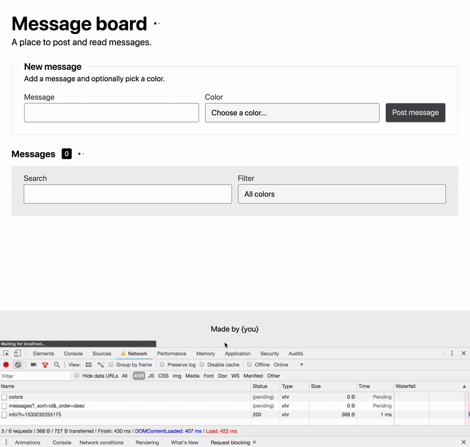

# What is it

A one page message board app. You can view, post, search, and filter messages.

## API

The list of messages and colors should be pulled from an API that is running in the background. You can see the endpoint at http://localhost:8080/api/messages and http://localhost:8080/api/colors. The API is powered by [json-server](https://github.com/typicode/json-server).
